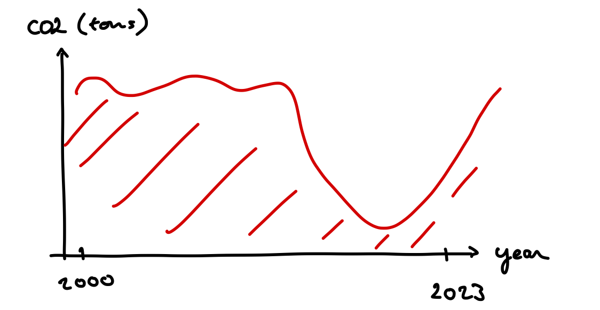
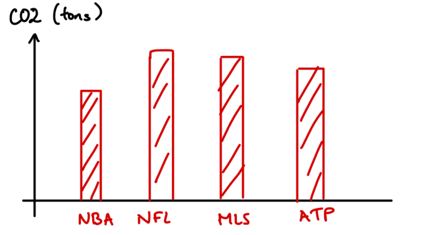
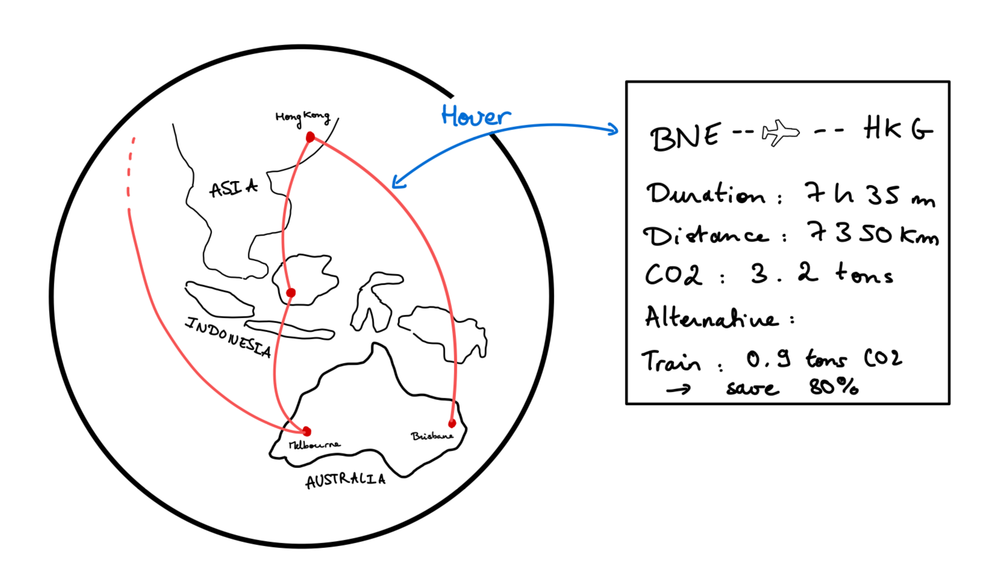
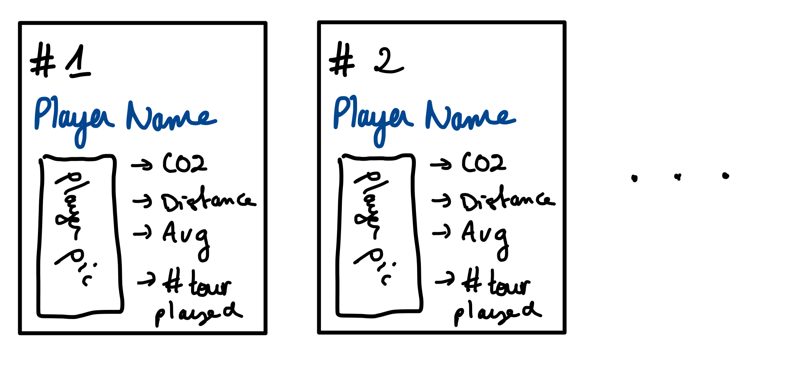
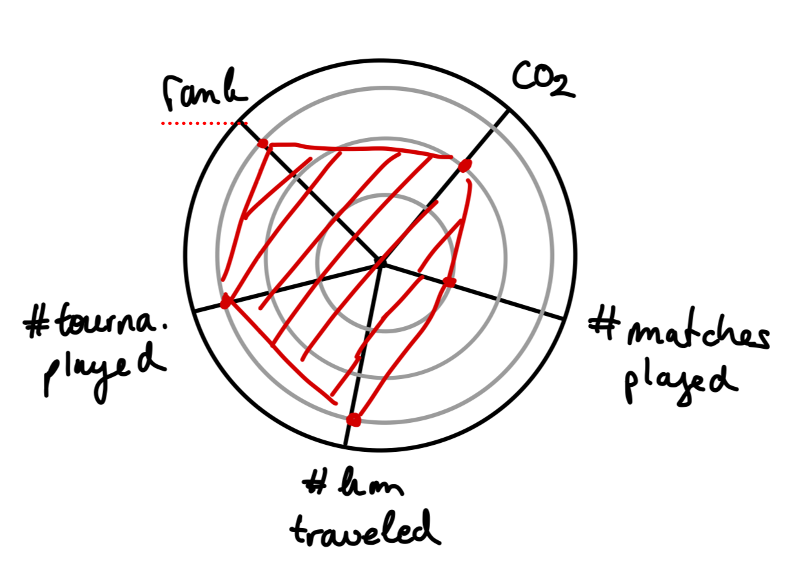

# COM-480: Data Visualization - GreenAce Project

## Milestone 2 (26th April, 5pm)

*E. Michelin, A. Doukhan, F. Dumoncel*

---

**Objective of the GreenAce Project**

The primary goal of the GreenAce project is to comprehensively analyze and visualize the environmental impact of player movements throughout an ATP tennis season. Our objective is to offer precise, realistic statistics paired with dynamic visual representations that elucidate the ecological footprint associated with professional tennis tours.

**Project Structure**

The project is structured into four main visualization components, each designed to address different aspects of player travel and associated CO2 emissions.

### I. Historical Analysis
   
- **Evolution of CO2 Emissions:** Focusing on the top 100 players, this graph will illustrates the trajectory of CO2 emissions over the last 20 years, providing insights into trends and changes in environmental impact over time. See below for an example of the visualization.
  
<figure align="center">
      
</figure>
  
   - **Comparative Impact Analysis**: To further enhance our historical perspective, this new component compares the environmental impacts of ATP seasons with those of other major international sports leagues, such as the NFL, NBA, and MLS. This comparison is visualized through a bar charts, which help contextualize the ATP's environmental footprint within the broader sports industry, offering insights into how tennis measures up against other sports in terms of travel-related emissions. See below for an example of the visualization.

<figure align="center">
  
</figure>

   - Tools needed: $\texttt{React, Python, Mui X}.$
   - Lectures needed: JavaScript, Data, Interaction

### II. Seasonal Tracking
   
- **Interactive 3D Globe Visualization:** Central to our project, this feature computes and displays the travel graph for each player, mapping out each journey on a 3D globe throughout the season. It highlights the CO2 emissions for each route and offers an interactive feature to explore alternative paths that could minimize these emissions. This visualization serves as the project's most complex and informative tool, offering users an engaging way to understand the environmental cost of travel in professional tennis.See below for an example of the visualization. 

<figure align="center">
  
</figure>

   - Tools needed: $\texttt{React, D3.js, Python, MapBox GL, Cytoscape.js, networkx}$
   - Lectures needed: Map, Graph, Interaction, D3.js, Data

### III. Environmental Impact Leaderboard
   
- **Top Polluters Ranking:** This feature displays a list of the top 10 players with the highest CO2 emissions, calculated from their travel activities throughout the season. Users can specify the year of interest. This leaderboard offers a straightforward summary of the players contributing most significantly to environmental impact, highlighting crucial areas for emissions reduction and facilitating the development of effective mitigation strategies. See below for an example of the visualization.
  
<figure align="center">
  
</figure>

   - Tools needed: $\texttt{React, Python}$
   - Lecture needed: Data, JavaScript 

### IV. CO2 Emissions Correlation Analysis

- **Radar Plot Correlations:** This component explores the relationship between CO2 emissions and various other factors such as ATP rankings, the number of matches played, and other relevant variables. By using a radar plot, we can visually compare the emissions against these covariates, identifying patterns and potential areas for emission reduction. See below for an example of the visualization.

<figure align="center">
  
</figure>

   - Tools needed: $\texttt{React, D3.js, Python, Mui X}$ 
   - Lecture needed: D3.js, JavaScript, Interaction
  

**Extras ideas**

If time allows, we would like to implement the following additional features: a player calendar. The player will select the tournaments that he wants to play during the season, and the tool will calculate the CO2 emissions for the selected tournaments. This feature will provide players with a tool to assess the environmental impact of their tournament choices and make more sustainable decisions. Eventually, we would like to extend this feature to include a recommendation system that suggests the most eco-friendly tournament schedules based on the player's preferences and constraints.
  
**Skeleton website**

The skeleton website is available at the following link: [GreenAce](https://greenace.fdumoncel.ch).
Note that the website is still under construction and will be updated with the new visualizations and features described above. In particular, not all the visualizations are currently available on the website. Note also that the website is not optimized for mobile devices, and you should use a desktop browser to view it and have the best experience.

**Conclusion**

Through these detailed visualizations, the GreenAce project aims to raise awareness and foster understanding among stakeholders about the significant environmental impacts of the professional tennis circuit. By providing clear, interactive, and informative tools, we hope to contribute to more sustainable practices within the sport.

